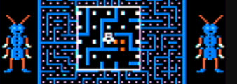

# Megabug

>>> deploy: 
>>>   +megabug.jpg 
>>>   +megabug.js 
>>>   +BinaryDataMegabug.js 
>>>   RAMUse.md 
>>>   Code.md 
>>>   ---- 
>>>   Journal.md 

# Code Links

* [Disassembled Code](Code.md)
* [RAM Usage](RAMUse.md)

# Cold Winter nights

I remember playing this game on cold winter nights during Christmas break from high school.

>>> tourGuide {

# Tour Guide
Check out the [maze generator code](Code.md#draw-the-maze). You can run the code to generate mazes right on the page. Click the "step" button to see the maze drawn in slow motion.

Have a look at game graphics: 
  * [Player mouth](Code.md#player-graphics)
  * [Bugs](Code.md#bug-graphics)
  * [Giant Bugs](Code.md#giant-bug-graphics)
  * [Text Characters](Code.md#character-graphics)

There is a [bug in the code](Code.md#code-bug). If you try to run the game on a CoCo less than 16K of RAM, you should
get an error message. Because of the code bug, you get garbage instead.

There are several "quirks" in the code that give it personality. Have a look at this [jump to next instruction](Code.md#quirks).
>>> }

# History
https://en.wikipedia.org/wiki/Dung_Beetles_(video_game)
1982 by Datasoft. Steve Bjork ported it to CoCo ... still licensed by Datasoft.
http://www.lcurtisboyle.com/nitros9/megabug.html

# Overview

Three screen buffers. Maze on first. 2nd and 3rd alternate drawing/display. Bugs and mouth
drawn on the magnifier (not magnification of smaller images).

Hold enter down at start to max bugs at 32. Maze gets tougher each level beaten. 9 different
difficulties. The last has no loops (see maze generator).

using the top of the stack as a register

Reward screen between levels.

# We Gotcha
Audio samples

# Random values

# Inputs

Joystick or keyboard ... orthogonal/reverse direction handling.

# A Code Bug

The "not enough memory" bug.

# The pixel doubler table

# Maze Generator
Loopiness. Copy text from code for detail.

