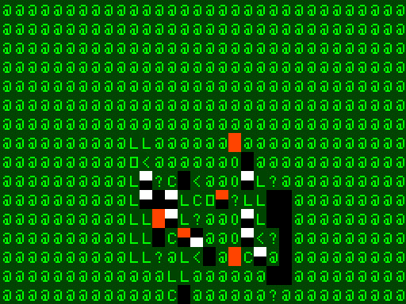
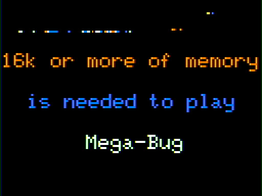

# Megabug

>>> deploy:<br>
>>>   +megabug.jpg<br>
>>>   +megabug.js<br>
>>>   +bug.jpg<br>
>>>   +lowram.jpg<br>
>>>   RAMUse.md<br>
>>>   %Code.md<br>
>>>   ----<br>
>>>   Journal.md<br>

# Code Links

* [Disassembled Code](Code.md)
* [RAM Usage](RAMUse.md)

# Cold Winter nights

I remember playing this game on cold winter nights during Christmas break from high school.

>>> tourGuide {

# Tour Guide
Check out the [maze generator code](Code.md#draw-the-maze). You can run the code to generate mazes right on the page. Click the "step" button to see the maze drawn in slow motion.

Have a look at game graphics: 
  * [Player mouth](Code.md#player-graphics)
  * [Bugs](Code.md#bug-graphics)
  * [Giant Bugs](Code.md#giant-bug-graphics)
  * [Text Characters](Code.md#character-graphics)

There is a [bug in the code](Code.md#code-bug). If you try to run the game on a CoCo less than 16K of RAM, you should
get an error message. Because of the code bug, you get garbage instead.

There are several "quirks" in the code that give it personality. Have a look at this [jump to next instruction](Code.md#quirks).
>>> }

# History

[Dung Beetles](https://en.wikipedia.org/wiki/Dung_Beetles_%28video_game%29) is an Apple II game written by Bob Bishop back in 1982.
Steve Bjork ported the game to the CoCo under the name Mega-Bug. Both games were licensed by Datasoft.

Game play from [Apple II Dung Beetles](https://www.youtube.com/watch?v=RB-y4qHI7cQ).

Game play from [CoCo Mega-Bug](https://www.youtube.com/watch?v=TQK982Kbe0s).

# Overview

The game uses a 4-color graphics mode with resolution 128x96 and 4 pixels per byte. 128*96/4 = 3072 (3K).

The game uses three graphics screen buffers starting at 0400, 1000, and 1C00. Three times
3K = 9K ... thus the 16K RAM requirement.

During game play, all three screen buffers are used. The first at 0400 shows the maze without the magnifier. This "source" screen
is used to update the drawing/showing buffers at 1000 and 1C00. The game flips between these two buffers after every refresh.

The maze pixels are doubled for the magnifier (actually quadrupled ... one pixel becomes a magnified block of four). Then the mouth
and any visible bugs are drawn right on the magnifier.

The maze itself is generated by code (details on that later). A single variable controls the "loopiness" of the maze. The more
"loopy" a maze it, the fewer dead-ends it has. Dead ends make the game harder since the player can get trapped. This
loopiness value divides down as the player progresses through levels. Each new maze is drawn less "loopy" than than the one
before it. There are nine different loopiness settings. After nine levels the mazes are as hard as they get.

There are some clever programming-ideas in the code. A common strategy throughout it to use the top of the stack as an
extra register. For instance:

```
D9A9: E7 E2          STB     ,-S                            ; Bit position to the stack
D9AB: A6 84          LDA     ,X                             ; Is the ...
D9AD: A8 E4          EORA    ,S                             ; ... player over ...
D9AF: A4 E0          ANDA    ,S+                            ; ... a dot?
```

The 6809's increment/decrement modes allow temporary values to be pushed and popped as part of the math operations. The first
line in this snippet pushes the value on the stack. The third and fourth lines use the stacked value. The fourth line pops
the value from the stack after the math.

# We Gotcha

When the player touches a bug, the game yells "we gotcha". This audio is generated as a square wave with the top four
bits of the 6-bit DAC toggling between all-on and all-off. A list of 2397 bytes controls the delay between each change.

This list of delays appears first in ROM -- well, after a 3-byte jump over the data section.

[Play "We Gotcha!"](Code.md#play-we-gotcha)

# Random values

The code uses the BASIC ROM from A000 to BFFF as a table of random values. A rolling pointer starts at A000 and
advances by 21 before each read. I need to do an analysis to see just how "random" that process is.

[Random number generator](Code.md#random-number)

# Inputs

You start a game by either pressing the button on the joystick or the space-bar on the keyboard. Whichever you pick,
the game uses that device for directional-input during the game.

The directional-input code is clever. You pass in the direction axis you want to check ... either left/right or up/down.
During game-play, the code first checks to see if you want to make an orthogonal change and then checks to see if you
want to make a 180 degree reverse back the way you came.

[Read directional input](Code.md#read-directional-input)

# A Code Bug

At startup, the code checks to see that more than 4K RAM is present. The CoCo came in 4K, 16K, 32K, and 64K versions.
The code can't run in 8K, but since that was never a product, as long as there is more than 4K, the code will start.

But if there is only 4K of RAM, the game wants to print a message on the screen. Trouble begins at CFF8 with a
jump-subroutine to D2BE. That address is data within the error message itself. It isn't a valid code address. Assuming
the "garbage code" does return with no damage, the routine continues to clear the screen and print the message.

[Code bug](Code.md#code-bug)

The problem is that the video display is still in text mode, and the display is set to 0000 -- not 0400 where the message
is drawn. Instead of the colorful message on the graphics screen, we end up with garbage on the text screen as seen here:



Maybe the code meant to jump to D2DE instead? This function does change the graphics mode, but it doesn't set the
display pointer. The upper part of the screen shows memory beginning at 0000. That area holds BASIC's variables and the game's 
own variables and stack. You can patch the code to change the address and play it in the emulator (or burn a new ROM). If you 
watch the screen carefully at startup, you can see the pixels flicker as the code changes its variables and stack while it draws 
the message.

As you look at the picture below, consider: nobody has ever seen this message before.



# The pixel doubler table

The pixel doubler routine needs a function to convert a pixel value like 00_00_00_10 from the small (original)
screen to a color mask like 10_10_10_10 to use in two bits on the magnified screen.

The doubler always works on one pixel value like 00_00_00_10 or 00_00_10_00 or 00_10_00_00 or 10_00_00_00.
All four of these values must yield 10_10_10_10.

The mapping function needs to be very fast since it is used to magnify 34*34 bits. A lookup table is the
fastest way -- take the pixel's value and look it up in a 256 byte table. Trade ROM space for speed.

There are four possible pixels. Each pixel has 2 bits -- 4 possible values per pixel. The possible values
for our mask-making can be enumerated:
  * 00,01,02,03 (far right pixel)
  * 00,04,08,0C (second from right)
  * 00,10,20,30
  * 00,40,80,C0 (left most pixel)
  
The zeros are all the same (producing 00_00_00_00). Thus there are only 13 possible values out of 256 that
need to be converted. The rest of the values in the 256 byte table don't matter since they will never be
used.

Rather than waste this space, the game sprinkles code into the large sections between values. The lookup
table goes from DB5C to DC5B. But several routines fill in the unused areas.

[Pixel Color Mask](Code.md#pixel-color-mask)

# Maze Generator

The maze is drawn right onto the first screen buffer (0400). The code draws all possible walls and then carves the
maze out with a number of runs. A run twists and turns for a random number of cells or until it is blocked. 

At the end of each run, the last wall is either left in place (dead-end) or opened into the neighbor (a loop). The 
choice is a random picked weighted by a "loopiness" variable. The higher the "loopiness" value, the more likely
the run will end in a loop. A value of zero means all runs end in a dead end.

With each level cleared, the loopiness divides down. The mazes become harder and harder (fewer loops ... more dead-ends
to get trapped in.

As a run clears out walls, the code builds a list of cells to "revisit" as the starting point of the next run. When the
list is empty, the maze is full and ready for play.

[Maze Generator](Code.md#draw-the-maze)
